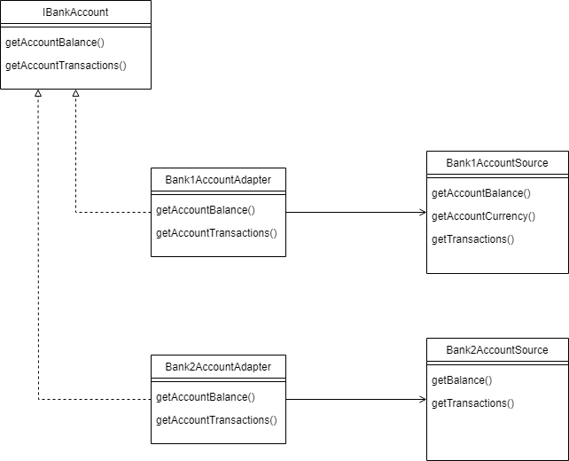

# PYYNE Digital Code Challenge

To solve this challenge I used the design pattern Adapter and the solution structure is illustrated below:



# :construction_worker: Installation

Before installing the dependencies of this project, you must have Node.js and NPM installed.

On the root directory, install the dependencies with:

```bash
$ npm i
```

# :rocket: Running the solution

After installing the dependencies, run:

```bash
$ npm run dev
```

This will run the code inside the ```index.ts``` file.

To run the unit tests simply enter:

```bash
$ npm run test
```

It will execute all the tests inside the ```__tests__``` directory.